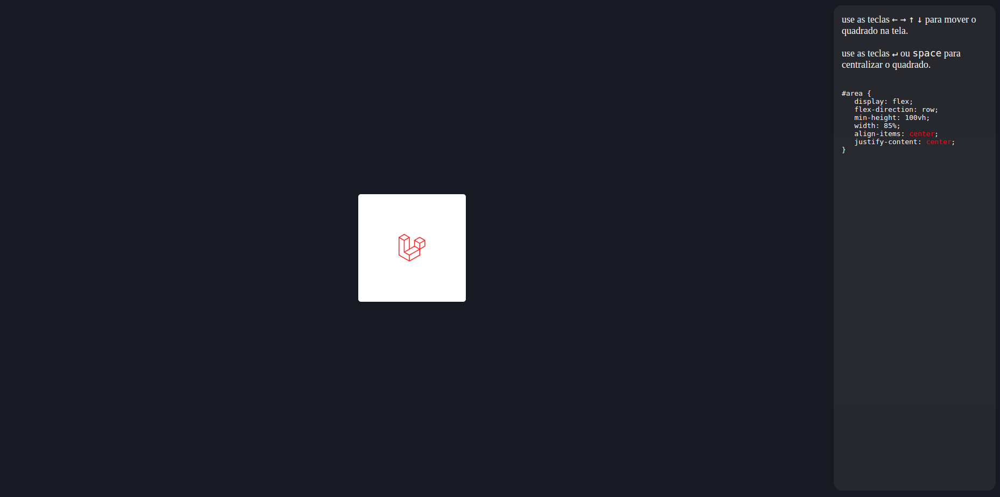

## Posicionando elemento na tela com display flex

use as teclas 
    <code>&larr;</code>
    <code>&rarr;</code>
    <code>&uarr;</code>
    <code>&darr;</code>
    para mover o quadrado na tela.

use as teclas 
    <code>&crarr;</code> ou <code>space</code>
    para centralizar o quadrado.

